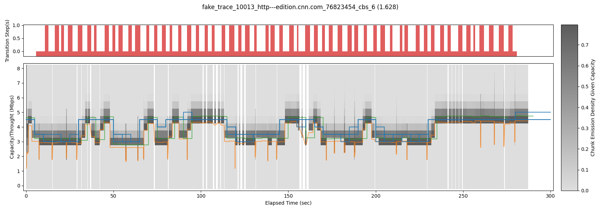

## Veritas: Answering Causal Queries from Video Streaming Traces

Veritas is an easy-to-interpret domain-specific ML model to tackle causal reasoning for video streaming.

Given data collected from real video streaming sessions, a video publisher may wish to answer "what-if" questions such as understanding the performance if a different Adaptive Bitrate (ABR) algorithm were used , or if a new video quality (e.g., an 8K resolution) were added to the ABR selection. Currently, Randomized Control Trials (RCTs) are widely used to answer such questions, also known as causal reasoning. However, RCTs require active interventions involving changing the system and observing the performance of real users. Thus, RCTs must be conservatively deployed as they could be disruptive to the performance of real users. 

Veritas tackles causal reasoning using passively collected data without requiring RCTs. Veritas enables more accurate trace-driven emulations and simulations of a wide range of design alternatives without impacting the performance of live users. For a given video session, it uses the observed data (chunk download times, chunk sizes, TCP states, etc.) to infer the latent Intrinisic Network Bandwidth (INB) during the session.  Once an INB sample is obtained, we can now directly evaluate the proposed changes, and return the answer to the what-if query. Further, rather than a single point estimate, Veritas provides a range of potential outcomes reflecting the inherent uncertainty in inferences that can be made from the data.

This artifact accompanies the paper: *"Veritas: Answering Causal Queries from Video Streaming Traces"*. Chandan Bothra, Jianfei Gao, Sanjay Rao, and Bruno Ribeiro. In Proceedings of the ACM Special Interest Group on Data Communication, SIGCOMM ’23, New York, NY, USA. If you use this artifact, please cite:
```
@inproceedings{Veritas_2023,
  author    = {Bothra, Chandan and Gao, Jianfei and Rao, Sanjay and Ribeiro, Bruno},
  title     = {Veritas: Answering Causal Queries from Video Streaming Traces},
  year      = {2023},
  url       = {https://doi.org/10.1145/3603269.3604828},
  doi       = {10.1145/3603269.3604828},
  booktitle = {Proceedings of the ACM Special Interest Group on Data Communication},
  series    = {SIGCOMM '23}
}
```
## Pre-requisites:

The following set up has been tested on Ubuntu 22.04.
  ```
  # Installing pip3
  sudo apt update
  sudo apt upgrade
  sudo apt-get install python3-pip

  # Installing conda
      * https://docs.conda.io/projects/conda/en/latest/user-guide/install/linux.html [python3.10]
  # Clone the repository.
  cd VeritasML
  conda create --name veritas
  conda activate veritas
  bash environment.sh
  ```

## Preparing dataset for Veritas:

For a given video sessions dataset collected by user, create an input directory <input_directory> with the following structure:
   ```
    input_directory/
    |_ video_session_streams/
    |_ ground_truth_capacity/
    |_ train_config.yaml
    |_ inference_config.yaml
    |_ full.json
    |_ fhash.json

   ```
 - **train_config.yaml**: It contains various parameters needed to train a dataset. Ex: [sample_file](src/data/datasets/Controlled-GT-Cubic-BBA-LMH/train_config.yaml).  
 - **inference_config.yaml**: It contains various parameters needed for inference using a dataset. Ex: [sample_file](src/data/datasets/Controlled-GT-Cubic-BBA-LMH/inference_config.yaml).

More details about the parameters used in training & inference and how to choose them are available in the sample configuration files shared above.  

 - **video_session_streams**: It contains the observed data relevant to a video session such as download time, 
 chunk size, TCP states (when available), etc. Each line in the video session file includes information about chunk payloads in a video session. The fields included in the file are: the start time (numpy.datetime64), end time (numpy.datetime64), size (KB), trans_time/download time (ms), cwnd (number), rtt (ms),rto (ms), ssthresh (number), last_snd (s), min_rtt (ms), delivery_rate (-). Ex: [sample_file](./src/data/datasets/Controlled-GT-Cubic-BBA-LMH/video_session_streams/fake_trace_10013_http---edition.cnn.com_76823454_cbs_6).
 - **ground_truth_capacity**: This is useful for evaluating the performance of Veritas by comparing the inferred values 
 with ground truth, and to plot figures. In emulation experiments, the INB is known and Veritas samples aspire to match 
 the INB. In real world data, we do not know the INB, hence we can make a best guess (or provide dummy values) for the INB. Please note: this data is not used by the core Veritas logic, it is only used for comparison when ground truth information is available. Each line in a ground truth capacity file includes the ground truth bandwidth (Mbps) and start time (numpy.datetime64) for that capacity. Ex: [sample_file](./src/data/datasets/Controlled-GT-Cubic-BBA-LMH/ground_truth_capacity/fake_trace_10013_http---edition.cnn.com_76823454_cbs_6).
 - **full.json**: It contains a list of the video session files to be used to for evaluation. Ex: [sample_file](./src/data/datasets/Controlled-GT-Cubic-BBA-LMH/full.json). This file is used to identify the sessions used for training, validation and inference. In our case, we use all the sessions for training and again use all the sessions for inference. Thus, full.json includes the names of all the sessions in the video_session_streams directory. The [script](./scripts/get_full.py) can be used to generate this file.
  ```
  python3 scripts/get_full.py --input_directory <path_to_input_directory>
  ```
 - **fhash.json**: It contains hash value for each file in the video_session_streams and ground_truth_capacity directory. It is useful to uniquely identify the input files and helps in logging the results. Ex: [sample_file](./src/data/datasets/Controlled-GT-Cubic-BBA-LMH/fhash.json). The [script](./scripts/get_fhash.py) can be used to generate this file.
  ```
  python3 scripts/get_fhash.py --input_directory <path_to_input_directory>
  ```

More details are shared [below](#input-dataset-details). For reference, we have shared a [dataset](./src/data/datasets/Controlled-GT-Cubic-BBA-LMH) used in the paper, which contains the files and directories mentioned above. This [dataset](./src/data/datasets/Controlled-GT-Cubic-BBA-LMH) contains video sessions emulated using BBA ABR algorithm and a 15s client buffer. More details about emulation setup are shared in the paper.

## Using Veritas
The following steps run Veritas for training and inference. We use the above dataset as input, but any user input directory with above defined structure can be used as an input. Please note the commands are run from the home directory, VeritasML. 

1. Training: The parameters (general, HMM, video sessions, etc.) from training configuration file in the input directory are used for training. The trained model is saved in the logs/fit/ directory with the name: <curent_timestamp>:<suffix_in_the_config_file>.
  ```
  python3 scripts/train.py --input_directory src/data/datasets/Controlled-GT-Cubic-BBA-LMH
  ```
2. Inference: The output model from training and the parameters (number of samples, duration of samples, etc.) from the inference configuration file in the input directory are used for inference of INB traces.
  ```
  python3 scripts/inference.py --input_directory src/data/datasets/Controlled-GT-Cubic-BBA-LMH --trained_model <path_to_trained_model>
  ```
The location and contents of output directory look like:
  ```
  logs/transform/<current_timestamp>:<suffix_in_the_config_file>
     |_ sample
        |_<session_1>
          |_ sample_full.csv
        |_<session_2>
          |_ sample_full.csv
        ...
        |_<session_1.png>
        |_<session_2.png>
        ...
  ```
Let's say we want to sample the INB traces, for a given session, for a duration of <num_sample_seconds=300> and also get <num_random_samples=3> (as defined in the inference configuration file). Further, the transition step size set during training be 5s. Then, each sample_full.csv has 300/5 = 60 lines and contains '3' comma separated values for the inferred INB for the given 
session in each line. Ex: [sample_full.csv](logs/transform/20230725122810:Controlled-GT-Cubic-BBA-LMH-logs/fit/20230725115631:Controlled-GT-Cubic-BBA-LMH-gaussian.asym-v10/sample/000.fake_trace_10013_http---edition.cnn.com_76823454_cbs_6/sample_full.csv).  
  ```
  0,1,2
  4.5,4.5,4.5
  3.5,3.5,3.5
  3.0,3.5,3.0
  3.0,3.5,3.0
  3.0,3.0,3.0
  3.5,3.5,3.0
  ...
  ```
Further, the output directory also contains the figures comparing the Ground Truth, Baseline (defined in the paper) and Veritas inferred INB traces. Ex: [sample figure].(logs/transform/20230725122810:Controlled-GT-Cubic-BBA-LMH-logs/fit/20230725115631:Controlled-GT-Cubic-BBA-LMH-gaussian.asym-v10/sample/000.fake_trace_10013_http---edition.cnn.com_76823454_cbs_6.png) 

## Using the inferred INB traces
Let's say we want to know the performance of BBA ABR if the client buffer size was changed from 15s to 5s. We can use the INB traces (using the sample_full.csv) and run emulation with new settings, i.e BBA with 5s buffer using emulation tools such as Mahimahi. In the emulation environment, we can now directly evaluate the performance of the proposed changes, and return the answer to the what-if queries.

## Parameter tuning
As mentioned above, the details of the parameters used for training and inference are provided in the config files. They are also available by running following commands from VeritasML directory:
```
Training: python3 fit.py -h
Inference: python3 transform.py -h
```
One of the special parameters used by Veritas is the Domain-specific emission model (f). Veritas has the flexibility to use custom functions for the emission models of Veritas’s High-order Embedded Hidden Markov Model (HoEHMM). We pass the emission functions in the fit.py and transform.py files. These functions use the fields described in the video_session_file (except download time) and 
possible capacity values for abduction as inputs and return the estimated throughput. For reference, we have included a few emission functions in [fit.py](fit.py) and [transform.py](transform.py) files in the VeritasML directory. To tune the parameters, one of the options is to test the deployed setting using the inferred INB traces and choose the setting with optimal performance. For ex: if we use the video sesisons data with BBA ABR and 15s buffer to infer INB traces, we can use emulate the inferred INB traces with same setting, i.e. BBA and 15s buffer and check the performance of the inferred INB traces.

## Other datasets
We have shared other datasets used in our emulation experiments: 
- MPC ABR, 15 s buffer: This is used to answer: what-if we change the ABR from MPC to BBA with same buffer size.
- BBA ABR, 5s buffer: This is used to answer: what-if we change the deployed buffer size from 15s to 5s for BBA.
   
## Contact
Please contact cbothra@purdue.edu for any questions.
   
   
